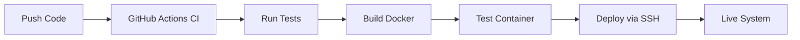

# GitHub Secrets Setup for Automated Deployment

To enable **automated deployment** to your server (192.168.0.32) via GitHub Actions, you need to set up GitHub repository secrets.

## 🔐 Required Secrets

### 1. `DEPLOY_USER`
- **Value**: Your username on the target server (e.g., `your_username`)
- **Purpose**: SSH username for connecting to 192.168.0.32

### 2. `DEPLOY_SSH_KEY`
- **Value**: Your private SSH key content
- **Purpose**: SSH authentication to the target server

## 📋 Setup Steps

### Step 1: Generate SSH Key (if not already done)
```bash
# On your local machine
ssh-keygen -t ed25519 -C "github-actions@yourdomain.com" -f ~/.ssh/github_actions

# Copy public key to target server
ssh-copy-id -i ~/.ssh/github_actions.pub your_username@192.168.0.32
```

### Step 2: Add Secrets to GitHub Repository

1. **Go to your GitHub repository**: https://github.com/toshan121/RealTimeData
2. **Click Settings** → **Secrets and variables** → **Actions**
3. **Click "New repository secret"**

#### Add `DEPLOY_USER`:
- **Name**: `DEPLOY_USER`
- **Secret**: `your_actual_username` (replace with your server username)

#### Add `DEPLOY_SSH_KEY`:
- **Name**: `DEPLOY_SSH_KEY`  
- **Secret**: Copy the entire private key content:
```bash
# Copy this output:
cat ~/.ssh/github_actions
```

### Step 3: Test SSH Connection
```bash
# Verify the key works
ssh -i ~/.ssh/github_actions your_username@192.168.0.32
```

## 🚀 How Automated Deployment Works

### **Current Manual Process:**
```bash
./deploy-remote.sh deploy  # You run this manually
```

### **New Automated Process:**
1. **Push code** to `main` branch
2. **GitHub Actions runs**:
   - ✅ Linting & security checks
   - ✅ Build Docker image  
   - ✅ Run full test suite in container
   - ✅ **Automatically deploy to 192.168.0.32**
3. **System is live** at http://192.168.0.32:8080

## 🔄 Complete CI/CD Pipeline



## 🎯 Benefits of GitHub Actions vs Manual SSH

| Aspect | Manual SSH | GitHub Actions |
|--------|------------|----------------|
| **Trigger** | Manual command | Automatic on push |
| **Consistency** | Manual steps | Identical every time |
| **Testing** | Optional | Always tested first |
| **Rollback** | Manual process | Git-based rollback |
| **Audit Trail** | Local logs only | Full GitHub logs |
| **Team Access** | Individual setup | Team-wide automation |

## 🔧 Troubleshooting

### SSH Connection Issues:
```bash
# Test connection manually
ssh -i ~/.ssh/github_actions your_username@192.168.0.32

# Check key permissions
chmod 600 ~/.ssh/github_actions
```

### GitHub Actions Deployment Failure:
1. Check the **Actions** tab in your GitHub repository
2. Look for deployment step errors
3. Verify secrets are set correctly
4. Ensure target server is accessible

## ✅ Ready to Go!

Once secrets are configured, every push to `main` will:
1. **Test the code** automatically
2. **Build the Docker container** 
3. **Deploy to 192.168.0.32** automatically
4. **Notify you** of success/failure

**No more manual deployment commands needed!** 🎉